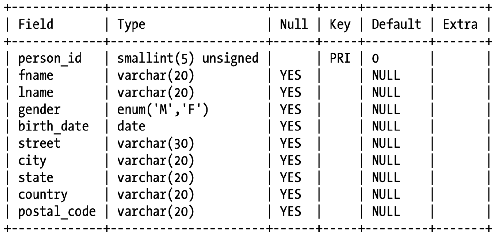

# CRUD

> CRUD: Create, Read, Update, Delete

Read [Data Types](./DataTypes.md)

## Create Table

```sql
CREATE TABLE person
(
    person_id   SMALLINT UNSIGNED,
    fname       VARCHAR(20),
    lname       VARCHAR(20),
    gender      ENUM ('M', 'F'),
    birth_date  DATE,
    street      VARCHAR(30),
    city        VARCHAR(20),
    state       VARCHAR(20),
    country     VARCHAR(20),
    postal_code VARCHAR(20),
    CONSTRAINT pk_person PRIMARY KEY (person_id)
);
```

Primary Key Constraint prevent user from inserting duplicate data regarding specific column(s).

### Create Another With Foreign Key

```sql
CREATE TABLE favorite_food     
  (person_id SMALLINT UNSIGNED,     
   food VARCHAR(20),     
   CONSTRAINT pk_favorite_food PRIMARY KEY (person_id, food),     
   CONSTRAINT fk_fav_food_person_id FOREIGN KEY (person_id)     
     REFERENCES person (person_id)     
  );
```

When a favorite food data is inserted but `person_id` DNE in person table, the foreign key constraint **fk_fav_food_person_id** is violated, and would raise an error.

### DESC/DESCRIBE

Use `describe` or `desc` to check the table definition.

```sql
DESC person;
```

<details>
<summary>See Output...</summary>

</details>
## Inserting Data

```sql
INSERT INTO person     
  (person_id, fname, lname, gender, birth_date,     
   street, city, state, country, postal_code)     
 VALUES (null, 'Susan','Smith', 'F', '1975-11-02',     
   '23 Maple St.', 'Arlington', 'VA', 'USA', '20220');
```

## Updating Data

### Update Data

```sql
UPDATE person
SET street      = '1225 Tremont St.',
    city        = 'Boston',
    state       = 'MA',
    country     = 'USA',
    postal_code = '02138'
WHERE person_id = 1;
```

### Update Table

```sql
ALTER TABLE person
ADD email varchar(255);

ALTER TABLE person
DROP COLUMN email;

ALTER TABLE person
ALTER COLUMN gender ENUM ('M', 'F', 'B');	-- SQL Server

ALTER TABLE person
MODIFY COLUMN gender ENUM ('M', 'F', 'B'); -- MySQL/Oracle
```

## Deleting Data

### Remove Data

```sql
DELETE FROM person
WHERE person_id = 2;
```

### Remove Table

```sql
DROP TABLE favorite_food;
DROP TABLE person;
```

## Read Data (Select)

See [Query](./Query.md).


