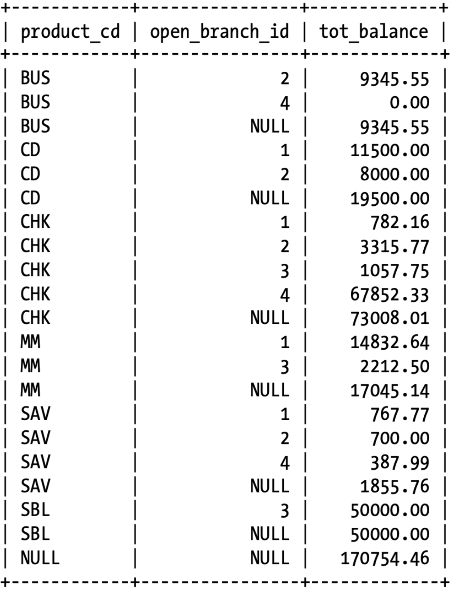
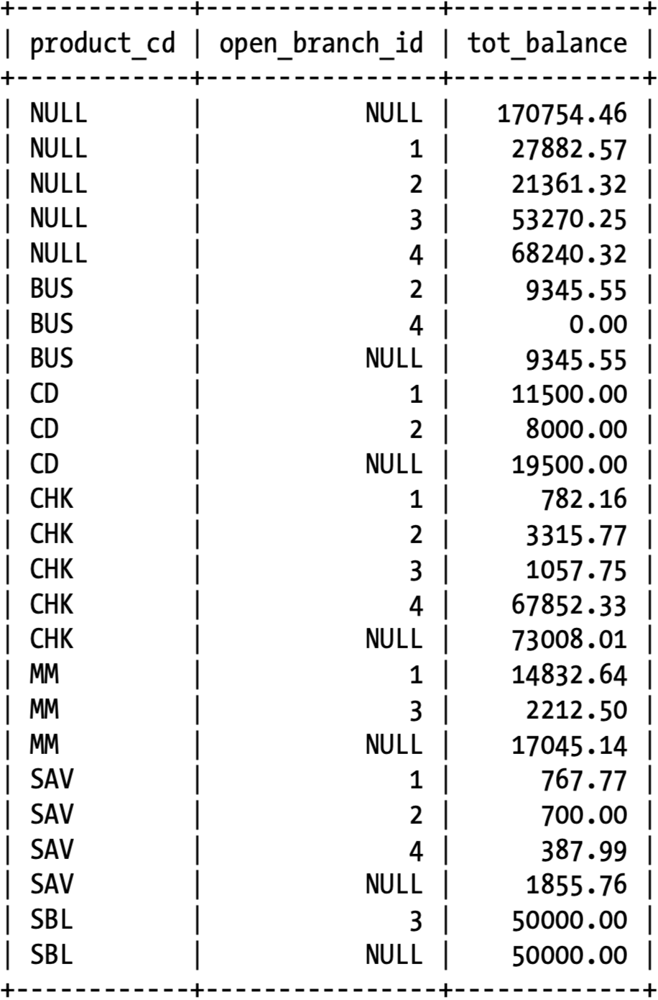

# Grouping and Aggregation

>  `GROUP BY` groups rows that have the same values into summary rows.

## HAVING

When grouping data, you may need to filter out undesired data from your result set based on groups of data rather than based on the raw data.

`group by` clause runs after `where` clause has been evaluated, you cannot add filter conditions to your `where` clause for this purpose.

You cannot refer to aggregate function `count(*)` in the `where` clause, because the groups have not yet been generated at the time the where clause is evaluated. Instead, you must put your group filter conditions in the having clause.

```mysql
-- Error
SELECT open_emp_id, COUNT(*) how_many     
FROM account     
WHERE COUNT(*) > 4     
GROUP BY open_emp_id;

-- Solution
SELECT open_emp_id, COUNT(*) how_many    
FROM account    
GROUP BY open_emp_id    
HAVING COUNT(*) > 4;
```

## Aggregate Functions

| Aggregate Function | Description                                |
| ------------------ | ------------------------------------------ |
| `Max()`            | Returns the maximum value within a set     |
| `Min()`            | Returns the minimum value within a set     |
| `Avg()`            | Returns the average value across a set     |
| `Sum()`            | Returns the sum of the values across a set |
| `Count()`          | Returns the number of values in a set      |

```mysql
SELECT MAX(avail_balance) max_balance,
       MIN(avail_balance) min_balance,
       AVG(avail_balance) avg_balance,
       SUM(avail_balance) tot_balance,
       COUNT(*)           num_accounts
FROM account
WHERE product_cd = 'CHK';
```

## Counting Distinct Values

```mysql
SELECT COUNT(DISTINCT id)
FROM account;
```

## Using Expressions

```mysql
SELECT MAX(pending_balance - avail_balance) max_uncleared
FROM account;
```

## How is NULL Handled?

Even with the addition of the null value to the table, the `sum()`, `max()`, and `avg()` functions all return the same values, indicating that they ignore any null values encountered.

## Grouping via Expressions

Group by the Year of **start_date**:

```mysql
SELECT EXTRACT(YEAR FROM start_date) year, COUNT(*) how_many
FROM employee
GROUP BY EXTRACT(YEAR FROM start_date);
```

## Generating Rollups

Let’s say, however, that along with the total balances for each product/branch combination, you also want total balances for each distinct product.

```mysql
SELECT product_cd,
       open_branch_id,
       SUM(avail_balance) tot_balance
FROM account
GROUP BY product_cd, open_branch_id
WITH ROLLUP;
```



Seven additional rows in the result set, one for each of the six distinct products and one for the grand total (all products combined).

### Oracle Database

```mysql
GROUP BY ROLLUP(product_cd, open_branch_id)
```

Advantage of this syntax: allows you to perform rollups on a subset of columns in the `group by` clause.

To perform rollups on only b and c:

```mysql
GROUP BY a, ROLLUP(b, c)
```

### with cube

If, along with totals by product, you also want to calculate totals per branch, then you can use the `with cube` option, which generates summary rows for all possible combinations of the grouping columns.

```mysql
SELECT product_cd, open_branch_id, SUM(avail_balance) tot_balance
FROM account
GROUP BY product_cd, open_branch_id
WITH CUBE;
```



Row 2-5 gives the total balance per branch regardless of **product_cd**.

#### Oracle Database

```mysql
GROUP BY CUBE(product_cd, open_branch_id)
```