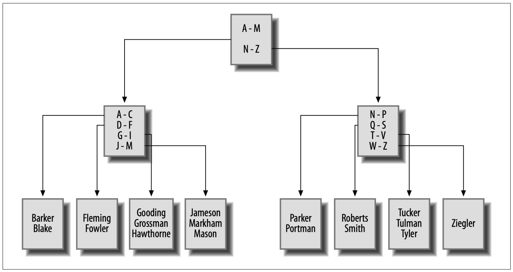
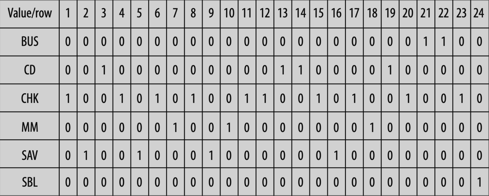

# Indexes

> Indexes are used by database server to locate rows in a table.
>
> Indexes are special tables that are kept in a specific order. An index contains only the column(s) used to locate rows in the data table, along with information describing where the rows are physically located.
>
> The role of indexes is to facilitate the retrieval of a subset of a table's rows and columns without the need to inspect every row in the table.

When a row is inserted into a table, it's not put in any particular location within the table (but put at the next available location within the file, server maintains a list of free space for each table).

## Index Scan

Server needs to inspect every row of a table for a query like `SELECT` (time consuming).

### Example

```mysql
SELECT dept_id, name
FROM department
WHERE name LIKE 'A%';
```

When the table contains millions of rows, the server connot answer a query within a reasonable amount of time. This is where *index* comes in.

## Table Creation

### MySQL

**MySQL** treats indexes as optional components of a table, so it uses `alter table` command for index addition or removal.

```mysql
ALTER TABLE department
ADD INDEX dept_name_idx (name);
```

### SQL Server & Oracle Database

Other database servers, including SQL Server and Oracle Database, treat indexes as independent schema objects. For both SQL Server and Oracle, therefore, you would generate an index using the `create index` command.

```sql
CREATE INDEX dept_name_idx
ON department (name);
```

As of MySQL version 5.0, a `create index` command is available, although it is mapped to the `alter table` command.

The query optimizer can choose to use the index if it is deemed to be beneficial.

If there are only a few rows in a table, the query optimizer might ignore the index.

If there is more than one index, the optimizer must decide which index will be the most beneficial for a particular SQL statement.

## Show Table Indexes

### MySQL

```mysql
SHOW INDEX FROM department \G
```

When a table is created with primary key constraint, **MySQL** server automatically generated an index on the primary key column. 

## Table Index Removal

### MySQL

Supports `drop index` command too.

```mysql
ALTER TABLE department
DROP INDEX dept_name_idx;
```

### Oracle

```sql
DROP INDEX dept_name_idx;
```

### SQL Server

```sql
DROP INDEX dept_name_idx ON department;
```

## Unique Indexes

Unique index can also serve as a mechanism for disallowing duplicate values in the indexed column. When a row is inserted or when the indexed column is modified, the database server checks the unique index to see whether the value already exists in another row in the table.

An error is raised when duplicate data is inserted.

Since primary key columns already have unique indexes, it's not needed to create unique indexes for them.

A table can have multiple unique indexes.

### MySQL

```mysql
ALTER TABLE department
ADD UNIQUE dept_name_idx (name);
```

### SQL Server & Oracle Database

```sql
CREATE UNIQUE INDEX dept_name_idx
ON department (name);
```

## Multicolumn Indexes

```mysql
ALTER TABLE employee
ADD INDEX emp_names_idx (lname, fname);
```

<details>
  <summary>Example</summary>
  This index will be useful for queries that specify the first and last names or just the last name, but you cannot use it for queries that specify only the employee’s first name. To understand why, consider how you would find a person’s phone number; if you know the person’s first and last names, you can use a phone book to find the number quickly, since a phone book is organized by last name and then by first name. If you know only the person’s first name, you would need to scan every entry in the phone book to find all the entries with the specified first name.
</details>

When building multiple-column indexes, therefore, you should think carefully about which column to list first, which column to list second, and so on so that the index is as useful as possible.

However, that there is nothing stopping you from building multiple indexes using the same set of columns but in a different order if you feel that it is needed to ensure adequate response time.

## Types of Indexes

### B-Tree Indexes

> Balanced-Tree Indexes

B-tree indexes are organized as trees, with one or more levels of branch nodes leading to a single level of leaf nodes.

Branch nodes are used for navigating the tree, while leaf nodes hold the actual values and location information.

It works like a binary search, balanced-tree property minimizes the average query (searching) time.

<details>
  <summary><code>employee.lname</code> Example</summary>

Index made on `lname` (lastname)



</details>

MySQL, Oracle Database, and SQL Server all default to B-tree indexing.

As rows are inserted/updated/deleted from a table, the server will attempt to keep the tree balanced so that there aren't fawr more branch/leaf nodes on one side of the root than the other.

By keeping the tree balanced, the server is able to traverse quickly to the leaf nodes to find the desired values without having to navigate through many levels of branch nodes.

### Bitmap Indexes

B-tree indexes handles columns with many different values (such as first name colume) well, but can be unwieldy with columns with only a few values.

For columns containing a small number of values across a large number of rows (*low-cardinality* data), the B-tree loses it advantage, the binary-search-like searching method eventually becomes a table scan.

To handle this situation more efficiently, Oracle Database includes *bitmap indexes*. Which generate a bitmap for each value stored in the column.

**accout.product_cd** column:



if you ask the server to retrieve all money market accounts (`product_cd = 'MM'`), the server simply finds all the 1 values in the MM bitmap and returns rows 7, 10, and 18.

Comparing 1's is much faster than comparing strings.

With *high-cardinality* data (many different values), bitmap index won't work well because server would need to maintain too many bitmaps.

For example, never use Bitmap Index on primary keys, since they have the highest cardinality.

**Oracle command for generating bitmap indexes:**

```mysql
CREATE BITMAP INDEX acc_prod_idx ON account (prodict_cd);
```

## Text Indexes

If your database stores documents, you may need to allow users to search for words or phrases in the documents. You certainly don’t want the server to open each document and scan for the desired text each time a search is requested, but traditional indexing strategies don’t work for this situation.

To handle this situation, **MySQL**, **SQL Server**, and **Oracle Database** include specialized indexing and search mechanisms for documents; both SQL Server and MySQL include what they call ***full-text indexes*** (for **MySQL**, **full-text indexes** are available only with its ***MyISAM*** storage engine), and Oracle Database includes a powerful set of tools known as ***Oracle Text***.

## How Optimizer Decides to Execute Queries (explain)

### MySQL

```mysql
EXPLAIN SELECT ...
FROM ...
WHERE ...
```

### SQL Server

Execute `set showplan_text on` before running SQL statement.

### Oracle Database

`explain plan` statement writes the execution plan to a special table called `plan_table`.

The execution plan describes which index to be used, number of rows to inspect.

## Downside of Indexes

### More Runtime

When a row is inserted/deleted all indexes on the table are modified.

When a row is modified, any indexes on the column(s) affected need to be modified.

The more indexes you have, the more work the server needs to do to keep all schema objects up-to-date, which tends to slow things down.

### More Disk Space Usage and Maintainance

Indexes requries disk space and maintainance from DB admin.

## Common Practice

If a job is not run very frequently (let's say monthly), do the following

+ Add the index
+ Run the routine
+ Drop the index

<details>
  <summary>Example</summary>
  In the case of data warehouses, where indexes are crucial during business hours as users run reports and ad hoc queries but are problematic when data is being loaded into the warehouse overnight (as updaing indexes for loaded data is super time consuming), it is a common practice to drop the indexes before data is loaded and then re-create them before the warehouse opens for business.
</details>

### Default Strategy

- **Make sure all primary key columns are indexed.**

    For multicolumn primary keys, consider building additional indexes on a subset of the primary key columns, or on all primary key columns but in a different order.

- **Build indexes on all columns that are referenced in foreign key constraints.**

    Server checks to make sure there are no child rows when a parent is deleted, so it must issue a query to search for a particular value in the column. If there's no index on that column, a table-scan must be performed.

- **Index any column that will frequently be used to retrieve data.**


