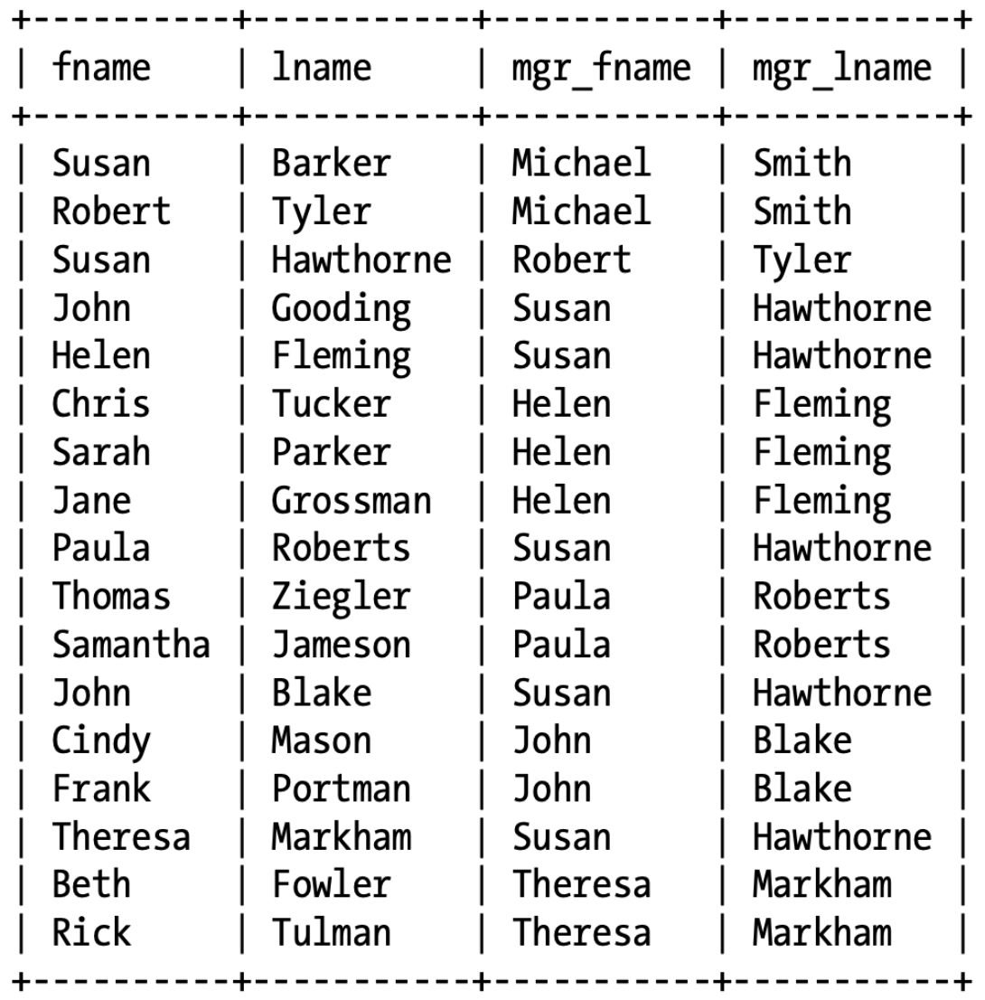
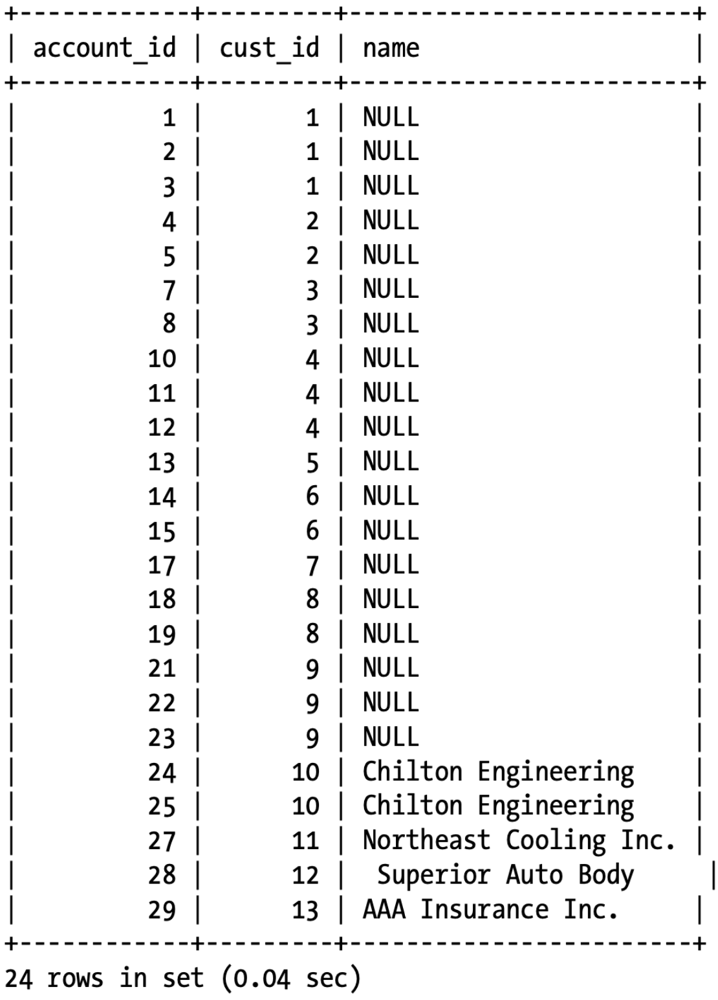

# Joins

## Inner Join

Join tables on conditions.

```mysql
SELECT ...
FROM A INNER JOIN B
ON A.id = B.id
```

### USING

```mysql
SELECT e.fname, e.lname, d.name     
FROM employee e INNER JOIN department d     
USING (dept_id);
```

### Use WHERE to JOIN

```mysql
SELECT A.id, B.title
FROM A, B, C
WHERE A.id = B.id
	AND B.title = C.title;
	
SELECT A.id, B.title
FROM A INNER JOIN B ON A.id = B.id
			 INNER JOIN C ON B.title = C.title;
```

### Does Join Order Matter?

**NO.**

It is up to the database server to determine how best to execute your query. The server must pick one of the tables as a starting point (The chosen table is thereafter known as ***driving table***).

If tables must be joined in a particular order, use

- `STRAIGHT_JOIN` in **MySQL**
- `FORCE ORDER` in **SQL Server**
- `ORDERED` or `LEADING` in **Oracle Database**

```mysql
SELECT STRAIGHT_JOIN <columns...>
FROM A INNER JOIN B ON ...
			 INNER JOIN C ON ...
WHERE ...;
```

It doesn't matter if the join conditions are placed in `WHERE` clause or `JOIN ON`.

### Self Join

Consider this example, self joining `employee` table to match each employee with their supervisor.

```mysql
SELECT e.fname, e.lname, e_mgr.fname mgr_fname, e_mgr.lname mgr_lname
FROM employee e INNER JOIN employee e_mgr
ON e.superior_emp_id = e_mgr.emp_id;
```



## Outer Join

An outer join includes all of the rows from one table and includes data from the second table only if matching rows are found.

```mysql
SELECT a.account_id, a.cust_id, b.name
FROM account a LEFT OUTER JOIN business b
ON a.cust_id = b.cust_id;
```

<details>
<summary>Result</summary>

</details>
If you want to outer-join tables A and B and you want all rows from A with additional columns from B whenever there is matching data, you can specify either `A left outer join B` or `B right outer join A`.

### Self Outer Joins

Recall the Self Join example in **Inner Join**, if changed to outer join, 

```mysql
SELECT e.fname, e.lname, e_mgr.fname mgr_fname, e_mgr.lname mgr_lname
FROM employee e LEFT OUTER JOIN employee e_mgr
ON e.superior_emp_id = e_mgr.emp_id;
```

The result set will include all employees, including those without supervisors (`mgr_fname`, `mgr_lname` would be NULL then).

If self right outer join is used, all supervisors are listed, including those ones who don't have an employee.

**When using outer joins, carefully consider whether a left or right outer join should be used.**

## Cross Join

> Joining multiple tables without specifying any join conditions.

```mysql
SELECT pt.name, p.product_cd, p.name
FROM product p CROSS JOIN product_type pt;
```

Using `JOIN` also works as `CROSS JOIN`.

Cross products/Cartesian Products.

## Natural Join

> Let database server determine what the join conditions need to be.

```mysql
SELECT a.account_id, a.cust_id, c.cust_type_cd, c.fed_id     FROM account a NATURAL JOIN customer c;
```

Database server would inspect table definitions and add the join conditions.

If the columns don't have the same name across the tables, the server would use cross-join without join condition instead.

**Avoid Natual Join and use Inner Joins with explicit join conditions.**


