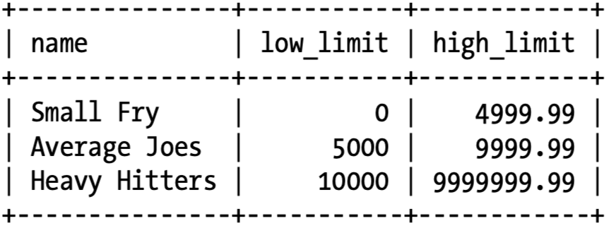

# Subquery

> A _subquery_ is query contained within another SQL statement.
>
> A subquery is always enclosed within parentheses, and it is usually executed prior to the containing statement.

## Subquery Types

- **_Noncorrelated Subqueries_**: some subqueries are completely self-contained.
- **_Correlated Subqueries_**: some subqueries reference columns from the containing statement.

### Noncorrelated Subqueries

#### Multiple-Row, Single-Column Subqueries

##### The in and not in operators

```sql
SELECT ...
FROM ...
WHERE val IN (1, 2);

-- equivalently
SELECT ...
FROM ...
WHERE val = 1 OR val = 2;
```

```sql
SELECT emp_id, fname, lname, title
FROM employee
WHERE emp_id IN (SELECT superior_emp_id
                 FROM employee);
```

##### all operator

The `all` operator allows you to make comparisons between a single value and every value in a set.

```sql
SELECT emp_id, fname, lname, title
FROM employee
WHERE emp_id NOT IN (SELECT superior_emp_id
                     FROM employee
                     WHERE superior_emp_id IS NOT NULL);
-- equivalent to "NOT IN"
SELECT emp_id, fname, lname, title
FROM employee
WHERE emp_id <> ALL (SELECT superior_emp_id
                     FROM employee
                     WHERE superior_emp_id IS NOT NULL);
```

##### any operator

```sql
SELECT account_id, cust_id, product_cd, avail_balance
FROM account
WHERE avail_balance > ANY (SELECT a.avail_balance
                           FROM account a
                                    INNER JOIN individual i
                                               ON a.cust_id = i.cust_id
                           WHERE i.fname = 'Frank'
                             AND i.lname = 'Tucker');
```

`=any` is equivalent to `in` operator.

#### Multicolumn Subqueries

```sql
SELECT account_id, product_cd, cust_id
FROM account
WHERE (open_branch_id, open_emp_id) IN
      (SELECT b.branch_id, e.emp_id
       FROM branch b
                INNER JOIN employee e
                           ON b.branch_id = e.assigned_branch_id
       WHERE b.name = 'Woburn Branch'
         AND (e.title = 'Teller' OR e.title = 'Head Teller'));
```

The subquery return 2 columns.

### Correlated Subqueries

A correlated subquery, on the other hand, is dependent on its containing statement from which it references one or more columns.

Unlike a noncorrelated subquery, a correlated subquery is not executed once prior to execution of the containing statement; instead, the correlated subquery is executed once for each candidate row (rows that might be included in the final results).

```sql
SELECT c.cust_id, c.cust_type_cd, c.city
FROM customer c
WHERE (SELECT SUM(a.avail_balance)
       FROM account a
       WHERE a.cust_id = c.cust_id)
          BETWEEN 5000 AND 10000;
```

#### The exists Operator

```sql
SELECT a.account_id, a.product_cd, a.cust_id, a.avail_balance
FROM account a
WHERE EXISTS(
    SELECT 1
    FROM transaction t
    WHERE t.account_id = a.account_id
      AND t.txn_date = '2008-09-22');
```

Using the exists operator, your subquery can return zero, one, or many rows, and the condition simply checks whether the subquery returned any rows.

## When to Use Subqueries

### Subqueries As Data Sources

```sql
SELECT d.dept_id, d.name, e_cnt.how_many num_employees
FROM department d
         INNER JOIN
     (SELECT dept_id, COUNT(*) how_many
      FROM employee
      GROUP BY dept_id) e_cnt
     ON d.dept_id = e_cnt.dept_id;
```

#### Data Fabrication

You can use subqueries to generate data that doesn’t exist in any form within your database and cannot be generated from existing data.

```sql
SELECT 'Small Fry' name, 0 low_limit, 4999.99 high_limit
UNION ALL
SELECT 'Average Joes' name, 5000 low_limit, 9999.99 high_limit
UNION ALL
SELECT 'Heavy Hitters' name, 10000 low_limit, 9999999.99 high_limit;
```



#### Task-Oriented Subqueries

### Subqueries in Filter Conditions

```sql
SELECT open_emp_id, COUNT(*) how_many
FROM account
GROUP BY open_emp_id
HAVING COUNT(*) = (SELECT MAX(emp_cnt.how_many)
                   FROM (SELECT COUNT(*) how_many
                         FROM account
                         GROUP BY open_emp_id) emp_cnt);
```

### Subqueries As Expression Generators
