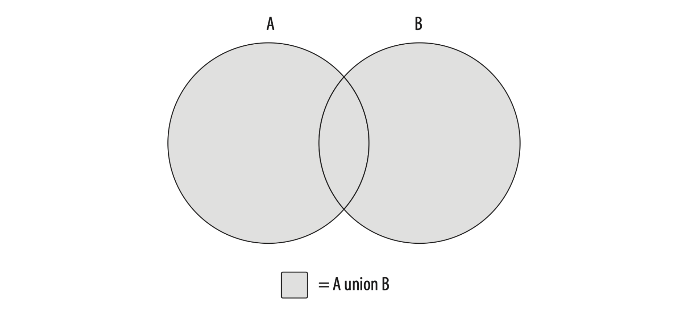
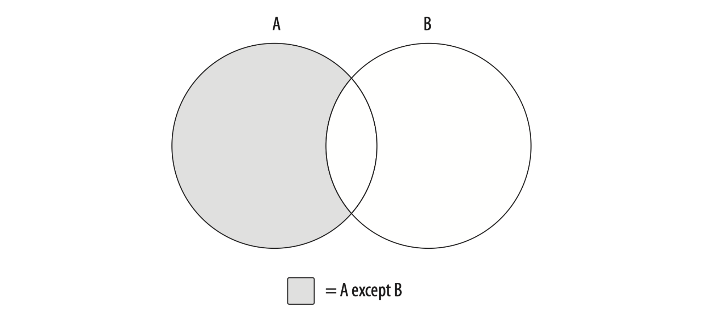
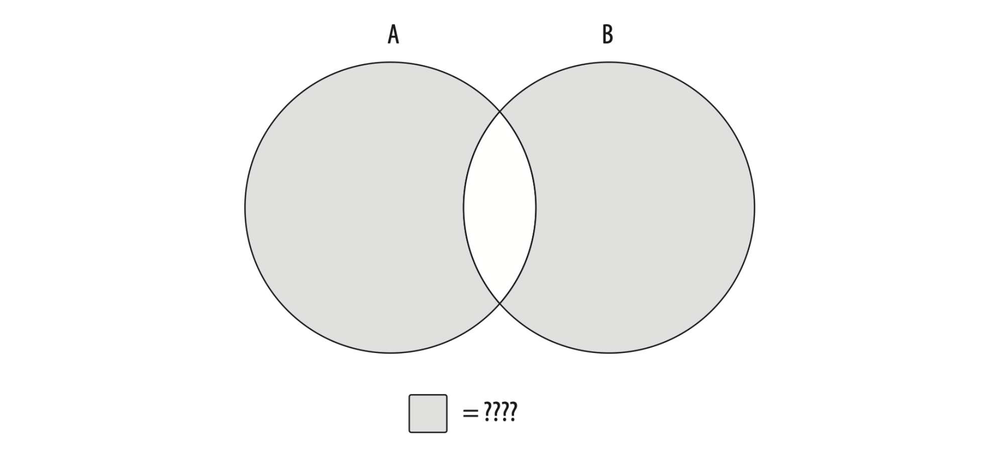

# Sets

## Set Theory

### Union



### Intersect


### Except



### Question



```
(A union B) except (A intersect B)
(A except B) union (B except A)
```

## Set Operators

### Union Operator

- `UNION ALL` doesn't remove duplicates.
- `UNION` exclude duplicate rows.

```mysql
SELECT id
FROM employee
WHERE ...
UNION									-- or UNION ALL
SELECT id
FROM account
WHERE ...
```

### Intersect Operator

- `INTERSECT ALL` operator does not remove duplicates
- `INTERSECT` operator removes duplicate rows

```mysql
SELECT id
FROM employee
WHERE ...
INTERSECT
SELECT id
FROM account
WHERE ...
```

### Except Operator

> The except operator returns the first table minus any overlap with the second table.

- `except` removes all occurrences of duplicate date from set A
- `except all` only removes one occurrence of duplicate data from set A for every occurrence in set B.

```mysql
SELECT id
FROM employee
WHERE ...
EXCEPT
SELECT id
FROM account
WHERE ...
```

#### Example

```python
setA = [10, 10, 10, 11, 12]
setB = [10, 10]
# A except B
> 11, 12
# A except all B
> 10, 11, 12
```

## Set Operation Precedence

In general, compound queries containing three or more queries are ***evaluated in order from top to bottom***, but with the following caveats:

- The ANSI SQL specification calls for the `intersect` operator to have precedence over the other set operators.
- You may dictate the order in which queries are combined by enclosing multiple queries in **parentheses**.


